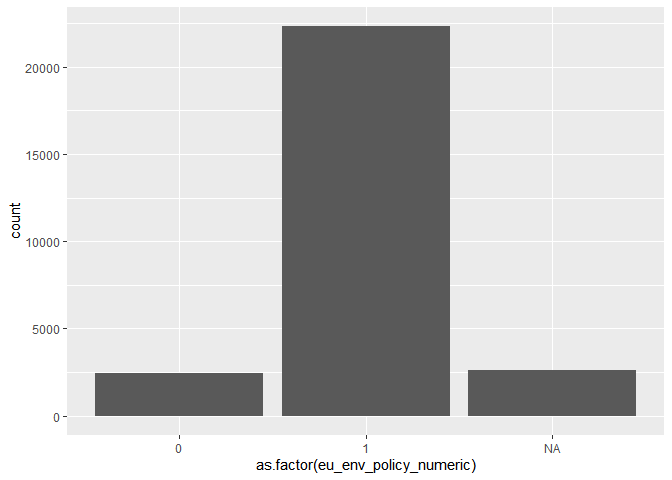
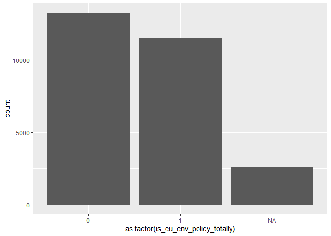

Processing Eurobarometer 90.2 (October-November 2018)
================
Daniel Antal, CFA
4/27/2020

  - [Setup The Eurobarometer Package](#setup-the-eurobarometer-package)
  - [Read In Data](#read-in-data)
      - [Preprocessing the Eurobarometer 80.2
        Data](#preprocessing-the-eurobarometer-80.2-data)
  - [Simple Models](#simple-models)
      - [Simple GLM model outside
        Poland](#simple-glm-model-outside-poland)
      - [Simple GLM model for Poland](#simple-glm-model-for-poland)
      - [Simple Model With Country
        Effects](#simple-model-with-country-effects)

## Setup The Eurobarometer Package

## Read In Data

You can read in the SPSS file with `haven`, which is part of
`tidyverse`.

``` r
# Change to eval=TRUE if you want to run this code
ZA7488_raw <- haven::read_spss(file.path("not_included", "ZA7488_v1-0-0.sav"))
```

You can analyze the SPSS file with `gesis_metadata_create`.

``` r
# Change to eval=TRUE if you want to run this code
ZA7488_metadata <- gesis_metadata_create(dat = ZA7488_raw)

ZA7488 <- ZA7488_raw %>%
  purrr::set_names ( as.character(ZA7488_metadata$canonical_name)) %>%
  mutate ( region_nuts_names  = haven::as_factor(region_nuts_codes)) %>%
  mutate ( region_nuts_codes =  as.character(region_nuts_codes)) 
```

### Preprocessing the Eurobarometer 80.2 Data

``` r
source(file.path("R", "which_coal_region.R"))
# Change to eval=TRUE if you want to run this code
eb18 <- ZA7488 %>%
  select ( one_of("eu_env_policy_statements_more_pub_fin_support_for_clean_energy_even_if_fossil_subsidies_reduced",
                  "region_nuts_names", "region_nuts_codes",
                  "age_exact", "age_education", "type_of_community",
                  "age_education_recoded_5_cat",
                  "country_code_iso_3166", 
                  "weight_result_from_target_redressment"),
           contains("occupation")) %>%
  dplyr::rename ( eu_env_policy  = eu_env_policy_statements_more_pub_fin_support_for_clean_energy_even_if_fossil_subsidies_reduced, 
                  w1 = weight_result_from_target_redressment ) %>%
  mutate ( eu_env_policy = haven::as_factor ( eu_env_policy )) %>%
  mutate_at ( vars(starts_with("type"),
                   contains("recoded"),
                   contains("occupation")), haven::as_factor) %>%
  mutate ( eu_env_policy_numeric = case_when (
           grepl("Totally agree|Tend to agree",
                 as.character(eu_env_policy))    ~ 1,
           grepl("disagree", as.character(eu_env_policy)) ~ 0,
           TRUE ~ NA_real_ )
           ) %>%
  mutate ( is_eu_env_policy_totally = case_when (
           grepl("Totally agree",
                 as.character(eu_env_policy))    ~ 1,
           grepl("Tend to|disagree", as.character(eu_env_policy)) ~ 0,
           TRUE ~ NA_real_ )
           ) %>%
  mutate ( total_agreement_weighted = w1*is_eu_env_policy_totally) %>%
  mutate ( age_education = recode_age_education(var = age_education,
                                                age_exact = age_exact )
           ) %>%
  mutate  ( is_rural = case_when (
    grepl ( "rural", tolower(as.character(type_of_community))) ~ 1,
    grepl ( "town", tolower(as.character(type_of_community)))  ~ 0,
    tolower(as.character(type_of_community)) == "dk" ~ NA_real_,
    TRUE ~ NA_real_)
) %>%
  mutate  ( is_student = case_when (
    grepl ( "studying", tolower(as.character(age_education_recoded_5_cat))) ~ 1,
    grepl ( "refuse", tolower(as.character(type_of_community)))  ~ NA_real_,
    TRUE ~ 0)
  ) %>%
  mutate ( year_survey = 2018 ) %>%
  mutate ( coal_region = which_coal_region(region_nuts_codes)) %>%
  mutate ( is_coal_region = ifelse (is.na(coal_region), 0, 1))

saveRDS(eb18,
        file.path("data", "eb18.rds"), 
        version = 2) # backward compatiblity
```

I created a coal region proxy with this document: [Coal regions in
transition](https://ec.europa.eu/energy/topics/oil-gas-and-coal/EU-coal-regions/coal-regions-transition_en)

## Simple Models

The problem with this variable is that it has very little variance.

``` r
library(ggplot2)

eb18 <- readRDS(file.path("data", "eb18.rds"))

eb18 %>%
  ggplot( data = ., 
          aes ( x= as.factor(eu_env_policy_numeric) )) +
  geom_histogram( stat = "count")
```

    ## Warning: Ignoring unknown parameters: binwidth, bins, pad

<!-- -->

``` r
eb18 %>%
  ggplot( data = ., 
          aes ( x= as.factor(is_eu_env_policy_totally ) )) +
  geom_histogram( stat = "count")
```

    ## Warning: Ignoring unknown parameters: binwidth, bins, pad

<!-- -->

### Simple GLM model outside Poland

``` r
summary ( glm ( is_eu_env_policy_totally ~ age_exact +
                  is_rural +
                  is_coal_region,
                data = filter ( eb18,
                                country_code_iso_3166!= "PL"),
                family = 'binomial'))
```

    ## 
    ## Call:
    ## glm(formula = is_eu_env_policy_totally ~ age_exact + is_rural + 
    ##     is_coal_region, family = "binomial", data = filter(eb18, 
    ##     country_code_iso_3166 != "PL"))
    ## 
    ## Deviance Residuals: 
    ##    Min      1Q  Median      3Q     Max  
    ## -1.141  -1.140  -1.003   1.215   1.393  
    ## 
    ## Coefficients:
    ##                  Estimate Std. Error z value Pr(>|z|)    
    ## (Intercept)    -8.405e-02  4.001e-02  -2.101   0.0357 *  
    ## age_exact      -7.167e-05  7.215e-04  -0.099   0.9209    
    ## is_rural       -6.518e-02  2.740e-02  -2.379   0.0174 *  
    ## is_coal_region -3.383e-01  5.749e-02  -5.884 4.01e-09 ***
    ## ---
    ## Signif. codes:  0 '***' 0.001 '**' 0.01 '*' 0.05 '.' 0.1 ' ' 1
    ## 
    ## (Dispersion parameter for binomial family taken to be 1)
    ## 
    ##     Null deviance: 32913  on 23812  degrees of freedom
    ## Residual deviance: 32871  on 23809  degrees of freedom
    ##   (2492 observations deleted due to missingness)
    ## AIC: 32879
    ## 
    ## Number of Fisher Scoring iterations: 3

Support for the target variable
`eu_env_policy_statements_more_pub_fin_support_for_clean_energy_even_if_fossil_subsidies_reduced`
coded to binary variable (agree, disagree) \* is shrinking with age. \*
less likely to be supported in rural areas, but this is not a
significant variable \* less likely to be supported in coal areas.

### Simple GLM model for Poland

The `coal regions` in Poland are not significant and do not have a
negative coefficient.

``` r
summary ( glm ( is_eu_env_policy_totally ~ age_exact +
                  is_rural + 
                  is_coal_region,
                data = filter ( eb18,
                                country_code_iso_3166 == "PL"),
                family = 'binomial'))
```

    ## 
    ## Call:
    ## glm(formula = is_eu_env_policy_totally ~ age_exact + is_rural + 
    ##     is_coal_region, family = "binomial", data = filter(eb18, 
    ##     country_code_iso_3166 == "PL"))
    ## 
    ## Deviance Residuals: 
    ##     Min       1Q   Median       3Q      Max  
    ## -1.0263  -0.9845  -0.9687   1.3592   1.4080  
    ## 
    ## Coefficients:
    ##                  Estimate Std. Error z value Pr(>|z|)  
    ## (Intercept)    -0.4973402  0.2246196  -2.214   0.0268 *
    ## age_exact       0.0003518  0.0040666   0.087   0.9311  
    ## is_rural       -0.0356018  0.1384704  -0.257   0.7971  
    ## is_coal_region  0.1017761  0.1386059   0.734   0.4628  
    ## ---
    ## Signif. codes:  0 '***' 0.001 '**' 0.01 '*' 0.05 '.' 0.1 ' ' 1
    ## 
    ## (Dispersion parameter for binomial family taken to be 1)
    ## 
    ##     Null deviance: 1231.7  on 921  degrees of freedom
    ## Residual deviance: 1231.1  on 918  degrees of freedom
    ##   (112 observations deleted due to missingness)
    ## AIC: 1239.1
    ## 
    ## Number of Fisher Scoring iterations: 4

### Simple Model With Country Effects

The Poland-only model is counterintuitive, becuase in Poland the level
of total agreement is 29% less likely than in the average EU country.

``` r
country_effects_18 <- glm ( is_eu_env_policy_totally ~
                              age_exact +
                              is_rural + 
                              country_code_iso_3166,
                data = eb18,
                family = 'binomial')

summary ( country_effects_18 )
```

    ## 
    ## Call:
    ## glm(formula = is_eu_env_policy_totally ~ age_exact + is_rural + 
    ##     country_code_iso_3166, family = "binomial", data = eb18)
    ## 
    ## Deviance Residuals: 
    ##     Min       1Q   Median       3Q      Max  
    ## -1.5291  -1.1104  -0.9101   1.2131   1.5587  
    ## 
    ## Coefficients:
    ##                             Estimate Std. Error z value Pr(>|z|)    
    ## (Intercept)               -0.0952937  0.0730342  -1.305 0.191967    
    ## age_exact                 -0.0005853  0.0007321  -0.800 0.423998    
    ## is_rural                  -0.1005625  0.0281266  -3.575 0.000350 ***
    ## country_code_iso_3166BE   -0.2068361  0.0901029  -2.296 0.021701 *  
    ## country_code_iso_3166BG   -0.2584107  0.0957111  -2.700 0.006936 ** 
    ## country_code_iso_3166CY    0.9028138  0.1172927   7.697 1.39e-14 ***
    ## country_code_iso_3166CZ   -0.6194229  0.0957543  -6.469 9.87e-11 ***
    ## country_code_iso_3166DE-E -0.2962542  0.1137450  -2.605 0.009200 ** 
    ## country_code_iso_3166DE-W -0.1147078  0.0917855  -1.250 0.211395    
    ## country_code_iso_3166DK    0.1250150  0.0923025   1.354 0.175607    
    ## country_code_iso_3166EE   -0.4553723  0.0975714  -4.667 3.06e-06 ***
    ## country_code_iso_3166ES    0.6145438  0.0930316   6.606 3.95e-11 ***
    ## country_code_iso_3166FI   -0.0426893  0.0920531  -0.464 0.642829    
    ## country_code_iso_3166FR   -0.1189659  0.0923405  -1.288 0.197628    
    ## country_code_iso_3166GB    0.2131367  0.0924043   2.307 0.021079 *  
    ## country_code_iso_3166GR   -0.0168089  0.0916605  -0.183 0.854498    
    ## country_code_iso_3166HR    0.1132982  0.0897591   1.262 0.206860    
    ## country_code_iso_3166HU    0.1604719  0.0904568   1.774 0.076060 .  
    ## country_code_iso_3166IE    0.4796980  0.0913206   5.253 1.50e-07 ***
    ## country_code_iso_3166IT   -0.1669919  0.0924151  -1.807 0.070766 .  
    ## country_code_iso_3166LT    0.0003592  0.0939971   0.004 0.996951    
    ## country_code_iso_3166LU   -0.0256665  0.1145326  -0.224 0.822681    
    ## country_code_iso_3166LV   -0.3412636  0.0965895  -3.533 0.000411 ***
    ## country_code_iso_3166MT    0.2866877  0.1133868   2.528 0.011458 *  
    ## country_code_iso_3166NL    0.3148488  0.0901416   3.493 0.000478 ***
    ## country_code_iso_3166PL   -0.2909351  0.0927514  -3.137 0.001709 ** 
    ## country_code_iso_3166PT    0.2792025  0.0918006   3.041 0.002355 ** 
    ## country_code_iso_3166RO   -0.0262389  0.0916650  -0.286 0.774689    
    ## country_code_iso_3166SE    0.4055062  0.0917655   4.419 9.92e-06 ***
    ## country_code_iso_3166SI    0.1628159  0.0917214   1.775 0.075879 .  
    ## country_code_iso_3166SK   -0.4351014  0.0968156  -4.494 6.99e-06 ***
    ## ---
    ## Signif. codes:  0 '***' 0.001 '**' 0.01 '*' 0.05 '.' 0.1 ' ' 1
    ## 
    ## (Dispersion parameter for binomial family taken to be 1)
    ## 
    ##     Null deviance: 34168  on 24734  degrees of freedom
    ## Residual deviance: 33571  on 24704  degrees of freedom
    ##   (2604 observations deleted due to missingness)
    ## AIC: 33633
    ## 
    ## Number of Fisher Scoring iterations: 4

A relatively good model takes the age, rural regions, coal regions and
countries. In Poland, even after controlling for age, lack of subjective
urbanization and coal regions, the country effect is significantly
negative.

``` r
summary ( glm ( is_eu_env_policy_totally ~
                              age_exact +
                              is_rural + 
                              is_coal_region + 
                              country_code_iso_3166,
                data = eb18,
                family = 'binomial') 
          )
```

    ## 
    ## Call:
    ## glm(formula = is_eu_env_policy_totally ~ age_exact + is_rural + 
    ##     is_coal_region + country_code_iso_3166, family = "binomial", 
    ##     data = eb18)
    ## 
    ## Deviance Residuals: 
    ##     Min       1Q   Median       3Q      Max  
    ## -1.5292  -1.1090  -0.9072   1.2192   1.5964  
    ## 
    ## Coefficients:
    ##                             Estimate Std. Error z value Pr(>|z|)    
    ## (Intercept)               -0.0946553  0.0730361  -1.296 0.194973    
    ## age_exact                 -0.0006034  0.0007322  -0.824 0.409873    
    ## is_rural                  -0.0999798  0.0281301  -3.554 0.000379 ***
    ## is_coal_region            -0.1209817  0.0592758  -2.041 0.041251 *  
    ## country_code_iso_3166BE   -0.2068222  0.0901027  -2.295 0.021710 *  
    ## country_code_iso_3166BG   -0.2583087  0.0957109  -2.699 0.006958 ** 
    ## country_code_iso_3166CY    0.9028817  0.1172924   7.698 1.39e-14 ***
    ## country_code_iso_3166CZ   -0.5937308  0.0965597  -6.149 7.80e-10 ***
    ## country_code_iso_3166DE-E -0.2350801  0.1176256  -1.999 0.045658 *  
    ## country_code_iso_3166DE-W -0.0883896  0.0926838  -0.954 0.340251    
    ## country_code_iso_3166DK    0.1253112  0.0923026   1.358 0.174586    
    ## country_code_iso_3166EE   -0.4552263  0.0975712  -4.666 3.08e-06 ***
    ## country_code_iso_3166ES    0.6268411  0.0932410   6.723 1.78e-11 ***
    ## country_code_iso_3166FI   -0.0424506  0.0920531  -0.461 0.644688    
    ## country_code_iso_3166FR   -0.1188905  0.0923403  -1.288 0.197911    
    ## country_code_iso_3166GB    0.2132355  0.0924042   2.308 0.021019 *  
    ## country_code_iso_3166GR   -0.0146698  0.0916680  -0.160 0.872856    
    ## country_code_iso_3166HR    0.1132381  0.0897589   1.262 0.207100    
    ## country_code_iso_3166HU    0.1605930  0.0904567   1.775 0.075839 .  
    ## country_code_iso_3166IE    0.4878495  0.0914158   5.337 9.47e-08 ***
    ## country_code_iso_3166IT   -0.1667910  0.0924151  -1.805 0.071105 .  
    ## country_code_iso_3166LT    0.0005148  0.0939969   0.005 0.995630    
    ## country_code_iso_3166LU   -0.0256380  0.1145323  -0.224 0.822874    
    ## country_code_iso_3166LV   -0.3412398  0.0965893  -3.533 0.000411 ***
    ## country_code_iso_3166MT    0.2867691  0.1133865   2.529 0.011435 *  
    ## country_code_iso_3166NL    0.3149638  0.0901414   3.494 0.000476 ***
    ## country_code_iso_3166PL   -0.2444311  0.0954802  -2.560 0.010467 *  
    ## country_code_iso_3166PT    0.2792000  0.0918004   3.041 0.002355 ** 
    ## country_code_iso_3166RO   -0.0123482  0.0919197  -0.134 0.893136    
    ## country_code_iso_3166SE    0.4058936  0.0917659   4.423 9.73e-06 ***
    ## country_code_iso_3166SI    0.1817151  0.0921973   1.971 0.048731 *  
    ## country_code_iso_3166SK   -0.3936395  0.0988987  -3.980 6.88e-05 ***
    ## ---
    ## Signif. codes:  0 '***' 0.001 '**' 0.01 '*' 0.05 '.' 0.1 ' ' 1
    ## 
    ## (Dispersion parameter for binomial family taken to be 1)
    ## 
    ##     Null deviance: 34168  on 24734  degrees of freedom
    ## Residual deviance: 33567  on 24703  degrees of freedom
    ##   (2604 observations deleted due to missingness)
    ## AIC: 33631
    ## 
    ## Number of Fisher Scoring iterations: 4
